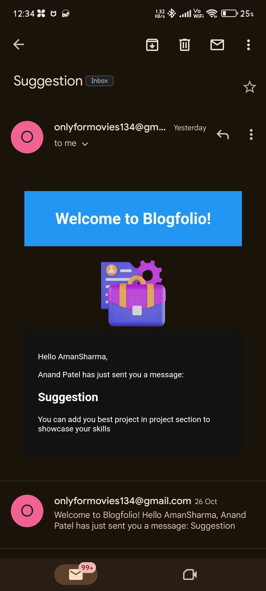
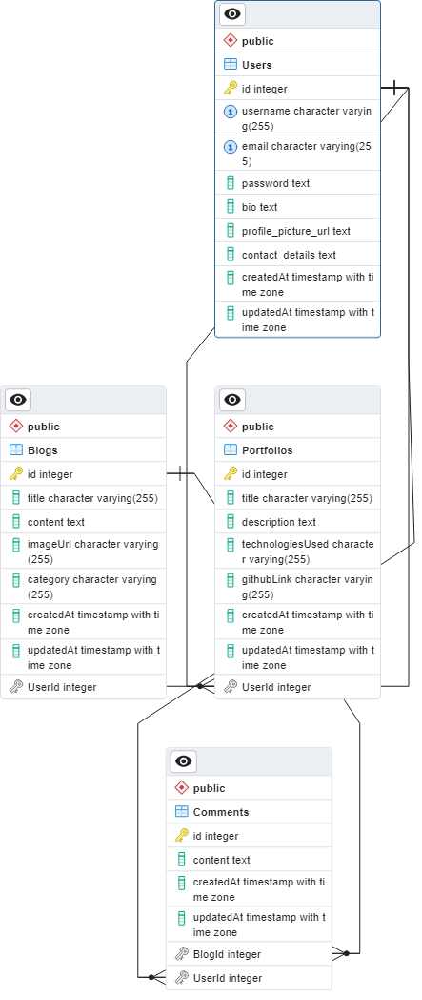

# Blogfolio

## Introduction

This Blogfolio project is a personal portfolio and blog platform that showcases a range of features and technologies. It serves as a demonstration of the integration of frontend and backend technologies. Below, you will find detailed information about the backend and frontend components, as well as the database and other relevant tools used in this project.

1. [Introduction](#introduction)
2. [Backend](#backend)
   1. [Technologies Used](#technologies-used)
   2. [Features](#features)
   3. [Setup](#setup)
      1. [Prerequisites](#prerequisites)
      2. [Installation](#installation)
   4. [API Endpoints](#api-endpoints)
3. [Frontend](#frontend)
   1. [Technologies Used](#technologies-used-1)
   2. [Installation](#installation-1)
   3. [Features](#features-1)
   4. [Screenshots](#screenshots)
4. [Database](#database)
5. [Application Demo](#application-demo)

## Backend

The backend of this project is built using Node.js and Express, and it provides the following features:

### Technologies Used

- **bcrypt**: Used for password encryption and hashing.
- **express**: The Node.js framework for building the RESTful API.
- **jsonwebtoken (JWT)**: Used for generating secure authentication tokens.
- **nodemailer**: Enables sending emails for contact form functionality.
- **pg (PostgreSQL)**: The database used for storing user and project data.
- **sequelize**: An ORM (Object-Relational Mapping) for working with the PostgreSQL database.

### Features

- **User Authentication:** Securely manage user access with login and registration functionality.
- **User Profile Management:** Allow users to update their profiles, including bio, contact info and profile picture.
- **Portfolio Section:** Project information storage, including descriptions, technologies used, and project links.
- **Blog Section:** Support for rich-text formatting and image embedding in blog posts including Comment section.
- **Contact Form:** Enable users to get in touch easily with a contact form .

### Setup

#### Prerequisites

- **Node.js:** Ensure you have Node.js installed on your system. You can download it from [Here](https://nodejs.org/en).

#### Installation

##### 1. Clone the Blogfolio repository to your local machine.

```
git clone https://github.com/Anandraj134/Nodejs-Training-Assignment-12.git
cd backend
```

##### 2. Install the project dependencies using npm.

```
npm install
```

##### 3. Set up environment variables by creating a .env file in the backend folder.

You will need to define the following variables:

- **For Database**:

  - DB_DIALECT: The database dialect you are using (PostgreSQL in this case).
  - DB_HOST: The hostname or IP address of your database server.
  - DB_PORT: The port on which your database server is running.
  - DB_USERNAME: The username for connecting to the database.
  - DB_PASSWORD: The password for connecting to the database.
  - DB_DATABASE: The name of your database.

- **For JWT**:
  - JWT_KEY: The key used for generating JWT tokens.
- **For Password Encryption**:
  - BCRYPT_SALT: The salt used for hashing passwords.
- **For Server**:
  - PORT: The port on which the server will run.
- **For Email**:
  - USER_EMAIL: The username for connecting to your Gmail server.
  - USER_PASSWORD: The password for connecting to your Gmail server.

##### 4. Start the server

```
npm start
```

### API Endpoints:

**Here is an overview of API endpoints, for more detailed information, please refer to the [API Documentation](api_doc.md).**

#### Authentication:

| Method | End Point | Description | Auth Token Required |
| :----: | :-------: | :---------: | :-----------------: |
|  POST  |   auth/   |   Signup    |                     |
|  GET   |   auth/   |    Login    |                     |

#### Blogs:

| Method | End Point |  Description  | Auth Token Required |
| :----: | :-------: | :-----------: | :-----------------: |
|  GET   |   blog/   | Get All Blogs |       &#9745;       |
|  POST  |   blog/   | Post New Blog |       &#9745;       |
|  PUT   | blog/:id  |  Update Blog  |       &#9745;       |
| DELETE | blog/:id  |  Delete Blog  |       &#9745;       |

#### Comments:

| Method |  End Point  |     Description      | Auth Token Required |
| :----: | :---------: | :------------------: | :-----------------: |
|  GET   | comment/:id | Get Comments By Blog |       &#9745;       |
|  POST  |  comment/   |   Post New Comment   |       &#9745;       |

#### Portfolio:

| Method |   End Point   |     Description      | Auth Token Required |
| :----: | :-----------: | :------------------: | :-----------------: |
|  GET   |  portfolio/   |  Get All Portfolio   |       &#9745;       |
|  GET   | portfolio/:id | Get User's Portfolio |       &#9745;       |
|  POST  |  portfolio/   |  Post New Portfolio  |       &#9745;       |
|  PUT   |   blog/:id    |   Update Portfolio   |       &#9745;       |
| DELETE |   blog/:id    |   Delete Portfolio   |       &#9745;       |

#### Contact Form:

| Method |   End Point   | Description | Auth Token Required |
| :----: | :-----------: | :---------: | :-----------------: |
|  POST  | contact_form/ | Send Email  |       &#9745;       |

#### User:

| Method | End Point  |     Description     | Auth Token Required |
| :----: | :--------: | :-----------------: | :-----------------: |
|  GET   | portfolio/ |    Get All Users    |       &#9745;       |
|  PUT   |   blog/    | Update User Details |       &#9745;       |

## Frontend

The frontend of this project is built using Flutter native mobile application views for Android. It provides the following features:

### Technologies Used

- **Flutter**: The framework for building the mobile applications.
- **flutter_markdown**: Used for rendering Markdown content in the blog section.
- **firebase**: Firebase services for cloud storage.
- **dio**: HTTP client for making API requests to the backend.
- **go_router**: Routing package for navigation within the app.
- **image_picker**: Allows users to pick images from their device.
- **provider**: Used for state management within the application.
- **webview_flutter**: Provides a WebView widget for displaying web content.

### Installation

#### Prerequisites

<b>Flutter:</b> Ensure you have Flutter installed on your development machine. You can find installation instructions at [flutter.dev](https://docs.flutter.dev/get-started/install).

#### Getting Started

##### 1. Clone the Blogfolio repository to your local machine.

```
git clone https://github.com/Anandraj134/Nodejs-Training-Assignment-12.git
cd frontend
```

##### 2. Install the project dependencies using Flutter's package manager, pub.

```
flutter pub get
```

##### 3. Set up the backend endpoint in the Flutter code. Open the <u><i>lib/constant/constant.dart</i></u> and specify the URL of your Gossip Grove backend API in <u><i>baseUrl</i></u> variable.

```
const baseUrl = 'https://your-server-url.com';
```

##### 4. Build and run the Flutter app on your preferred platform (iOS or Android).

```
flutter run
```

### Features

- **User-Friendly Interface:**  Animate transitions and interactions for a visually appealing and engaging user interface.
- **Portfolio Showcase:** Present your projects elegantly, allowing visitors to explore your work effortlessly.
- **Dynamic Blogging:** Create and manage blog posts with rich formatting options, enhancing content quality.
- **Responsive Design:** Ensure a consistent and attractive experience on various devices.
- **Comment Interaction:** Enable visitors to engage with your blog posts through a user-friendly comment section.
- **Categories:** Organize your blog posts using categories for easy content discovery.
- **Contact Form Integration:** A user-friendly contact form for visitors to reach out, enhancing communication.
- **API Integration:** Seamlessly connect the frontend with the backend, ensuring secure and efficient data exchange.

### Screenshots

<p align="center">


</p>
<br>
<p align="center">


</p>
<br>
<p align="center">


</p>
<br>
<p align="center">



</p>
<br>
<p align="center">


</p>
<br>
<p align="center">


</p>

## Database

- PostgreSQL

### Schema Design




## Application Demo
```
https://drive.google.com/drive/folders/1d98ffRdns_cYCYA9IVwba3d_-wF6jcBH?usp=sharing
```